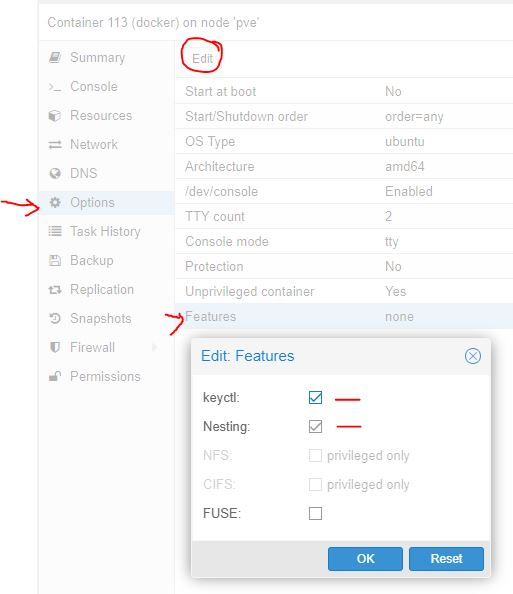
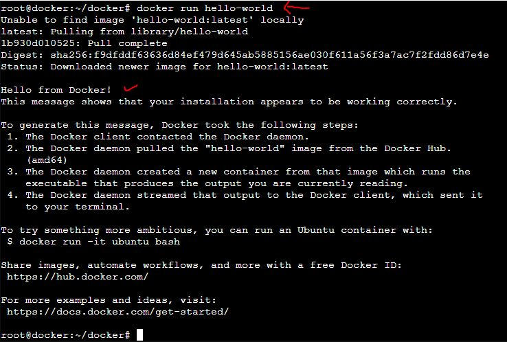

# Install docker in LXC
This will show you how you can create a LXC container to host your docker images.
You might be in confusion , LXC itself is a container, how a container can host container. 
Proxmox supports, nested container featers

# Step 1 : Create an LXC container
- Unprivileged Container
- 2gb+ ram(i used 4gb)
- 2 or more core
- 16gb+ storage
- static IP adderss
- Don't auto start

# Step 2: Change Options of LXC
- In Created LXC, goto 'Options' -> select 'Features' and select 'keyctl' & 'nesting'

# Step 3: install docker manually

		apt-get update
		wget https://download.docker.com/linux/debian/dists/buster/pool/stable/amd64/docker-ce_19.03.8~3-0~debian-buster_amd64.deb
		wget https://download.docker.com/linux/debian/dists/buster/pool/stable/amd64/docker-ce-cli_19.03.8~3-0~debian-buster_amd64.deb
		wget https://download.docker.com/linux/debian/dists/buster/pool/stable/amd64/containerd.io_1.2.6-3_amd64.deb
		dpkg -i containerd.io_1.2.6-3_amd64.deb docker-ce-cli_19.03.8~3-0~debian-buster_amd64.deb docker-ce_19.03.8~3-0~debian-buster_amd64.deb
		
# Test 
- in cli, run this 
	
        docker run hello-world
		
 		