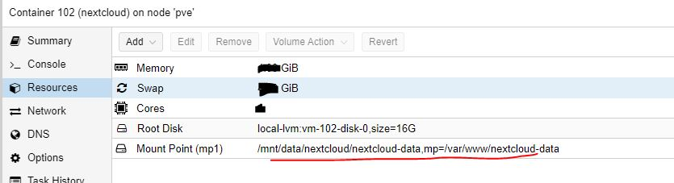

# Next cloud Setup
- Nextcloud Host will be a container/LXC 
- Next clould Data will be in seperate folder/HDD (for easy data mintanance & backup) 

### Benifits of the setup 
- Data is separate from nextcloud configuration
- All configurations will be backed up regularly
- Data can be moved, maintained, and scaled up centrally

# Setup :  From HOST PVE 
### Preapere a shared folder as next cloud data
- A ZFS pool permanently mounted in **/mnt/data/** 
- my nextcloud data folder path will be **/mnt/data/nextcloud/nextcloud-data**
- Set Proper permission   ```chown -R 100000:100000 /mnt/data/nextcloud/nextcloud-data```
  
# Setup : Guest LXC nextcloud 
- Create an LXC(CT) Nextclould from turnkey nexcloud image and DO NOT TURN ON Container after creation. In this my container id is 102.
- mount share folder **from host** ```pct set 102 -mp1 /mnt/data/nextcloud/nextcloud-data,mp=/var/www/nextcloud-data```
- Turn on Container and you login to Guest CLI
- Change permission of the folder
```chown -R www-data:www-data /var/www/nextcloud-data
chmod -R 0770 /var/www/nextcloud-data```

- Researt the Container and continue finishing setup
- You can setup with domain name
- you can setup with let's encrypt
 
### Turn off LXC

Make sure , you can see this from webgui to your LXC, in my case 102




# Tips : 

- if you see http 500 on web gui, please see logs /var/www/nextcloud/data/nextcloud.log 
- if you see permisssion issues, you can redo permission from LXC 

          chown -R www-data:www-data /var/www/nextcloud-data     
          chmod -R 0770 /var/www/nextcloud-data

- To change permissoin , you may need to stop apache service ```service apache2 stop``` & start after changing permission     

- if you have permission issues further (like when you are using shared ZFS) what you can do before starting LXC

From Host : change permission of the folder to default root(100000) group (unprevilished container)

```chown -R 100000:100000 /mnt/data/nextcloud/nextcloud-data``` 

then From Guest : 

```chown -R www-data:www-data /var/www/nextcloud-data```  

```chmod -R 0770 /var/www/nextcloud-data```

### Updated 
- From Host
-   ```chown -R 100000:100000 /mnt/data/nextcloud/nextcloud-data```
-   ```pct set 102 -mp1 /mnt/data/nextcloud/nextcloud-data,mp=/var/www/nextcloud-data```
From Guest


# Notes :
- Nectcloud Turnkey container project [Link](https://www.turnkeylinux.org/nextcloud)
- Download [nextcloud container](http://mirror.turnkeylinux.org/turnkeylinux/images/proxmox/debian-12-turnkey-nextcloud_18.1-1_amd64.tar.gz)  from your CT Templatefrom [page](http://mirror.turnkeylinux.org/turnkeylinux/images/proxmox/)
