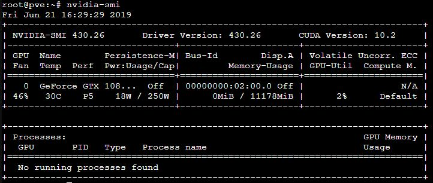

# Install nvdia driver 
- Target : Passthrought LXC containers 
- Multiple shared LXC (one at a time) to have multiple deeplearning encironments 

# Step 0 : Make sure your Card is detected 
    
    lspci | grep "VGA"
 
 This will show you all of GPUs installed. Make sure you can see your's. 
 
# Step 1 : update distro 
    
    apt update && apt dist-upgrade -y 
    
# Step 2 : disable nouveau driver : its opensource nvdia driver
- Create this file : ‘/etc/modprobe.d/nvidia-installer-disable-nouveau.conf’
- Put this lines in the file 

        blacklist nouveau
        options nouveau modeset=0

# Step 3 : Install necessary packages 

    apt-get install gcc make dkms build-essential

# Step 4 : Install Kernell headers 
- Know your kernel version 

        uname -r

This will give your your version of kernell. For my version "4.15.18-14-pve"
- Install header for your kernel (example with my version) : Make sure you add the prefix "pve-headers-" before version no. 

        apt install -y pve-headers-4.15.18-14-pve

# Step 5 : Install NVdia Drivers 
- Download from : https://www.nvidia.com/object/unix.html 
- for me 

        wget https://international.download.nvidia.com/XFree86/Linux-x86_64/430.26/NVIDIA-Linux-x86_64-430.26.run
        chmod +x Linux-x86_64/430.26/NVIDIA-Linux-x86_64-430.26.run
        ./Linux-x86_64/430.26/NVIDIA-Linux-x86_64-430.26.run
- Check Nvdia version info : 
    
        nvidia-smi
    
    
    

or 

        cat /proc/driver/nvidia/version

# Step 6 (optional): Patch Driver: 
- For Maximum number of simultaneous NVENC video encoding sessions . I will be using to video encoding when its idle. This may not need for other purposes. 
- Clone from tracked repository & install it 

        git clone https://github.com/keylase/nvidia-patch.git
        cd nvidia-patch
        bash ./patch.sh
# Step 7 : Keep driver running for sharing with LXC
- run Nvidia Persistenced 
        
        nvidia-persistenced
 - check if it is runing : you should be able to see .pid file & socket in "/var/run/nvidia-persistenced" folder
